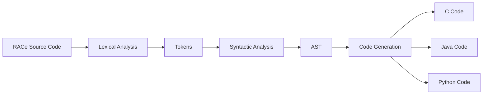
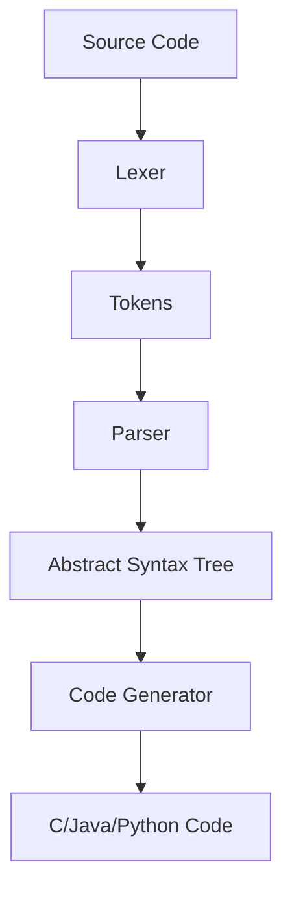

# RACe Language Guide - Version 1.1

## Introduction to RACe
RACe is a **simple, expressive programming language** designed for educational purposes and easy transformation into popular languages. With its clean syntax and dynamic typing, RACe provides an excellent platform for learning programming fundamentals while enabling cross-language compilation.



## Language Features

### 1. Data Types
RACe supports four fundamental data types:

| Type    | Example         | Description                |
|---------|-----------------|----------------------------|
| `int`   | `42`            | Integer values             |
| `float` | `3.14159`       | Floating-point numbers     |
| `logic` | `true`, `false` | Boolean values             |
| `string`| `"Hello RACe"`  | Text strings               |

### 2. Variable Declaration
Variables are declared with explicit type keywords:

```race
int count = 10;
float pi = 3.14159;
logic isActive = true;
string greeting = "Welcome to RACe!";
```

### 3. Operators
RACe supports a comprehensive set of operators:

**Arithmetic Operators**
```race
int sum = a + b;
int difference = x - y;
float product = width * height;
float quotient = total / count;
```

**Comparison Operators**
```race
logic isEqual = (a == b);
logic notEqual = (x != y);
logic lessThan = (score < passing);
```

### 4. Control Flow

**Conditional Statements**
```race
if (temperature > 30) {
    print("Hot day!");
} else if (temperature < 10) {
    print("Cold day!");
} else {
    print("Pleasant weather!");
}
```

**Loop Structures**
```race
int i = 0;
while (i < 10) {
    print(i);
    i = i + 1;
}
```

### 5. Functions
Functions are declared with the `func` keyword:

```race
func calculateArea(float width, float height) {
    return width * height;
}

float roomArea = calculateArea(4.5, 3.2);
print(roomArea);
```

### 6. Input/Output
The `print` statement outputs values:

```race
print("The result is: " + result);
```

## Compilation Workflow

RACe code is transformed into executable code through a three-stage compilation process:



## Compiler Usage

### 1. Compiling to C

**Step-by-Step:**
```bash
# Compile RACe compiler
g++ -std=c++17 -o race_compiler race_compiler.cpp

# Compile RACe program to C
./race_compiler program.race > output.c

# Compile and run generated C
gcc output.c -o program
./program
```

### 2. Compiling to Java

**Step-by-Step:**
```bash
# Compile RACe compiler
g++ -std=c++17 -o race_java_compiler race_java.cpp

# Compile RACe program to Java
./race_java_compiler program.race

# Save generated Java files
# (Main.java and RACeValue.java)

# Compile and run Java
javac Main.java RACeValue.java
java Main
```

### 3. Compiling to Python

**Step-by-Step:**
```bash
# Run Python compiler
python rac_to_py.py program.race > output.py

# Execute Python program
python output.py
```

## Sample Program

**RACe Source:**
```race
func factorial(int n) {
    if (n <= 1) {
        return 1;
    }
    return n * factorial(n - 1);
}

print("5! = " + factorial(5));
```

**Equivalent Python Output:**
```python
def factorial(n):
    if (n <= 1):
        return 1
    return n * factorial(n - 1)

print("5! = " + str(factorial(5)))
```

## Key Advantages

1. **Cross-Platform Compatibility:** Compile to C, Java, or Python
2. **Simple Syntax:** Easy to learn for beginners
3. **Dynamic Typing:** Flexible variable usage
4. **Educational Focus:** Ideal for teaching programming concepts
5. **Extensible Design:** Easily add new language features

For more information, explore the compiler source code to understand RACe's internal architecture and compilation process.
